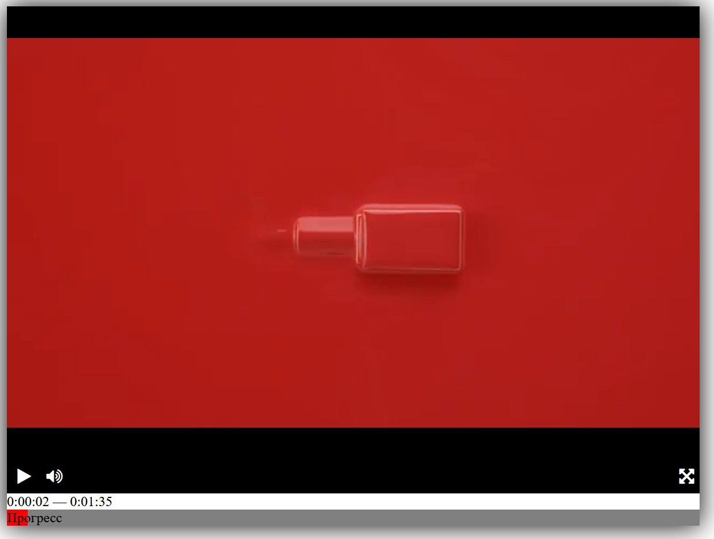

# Проект видеоплеер

Данный проект реализует простейший видеоплеер для браузера



### [Пример работы видеоплеера](https://vladimir-study.github.io/videoplayer/)

## Стек технологий
1. HTML
2. CSS
3. JS

## Использование плеера
Для запуска плеера достаточно клонировать данный репозиторий на 
локальный компьютер командой ```git clone``` 
и открыть [index](index.html) файл в браузере.

В папке [dist](dist) находятся все исходники для добавления плеера в свой проект.


